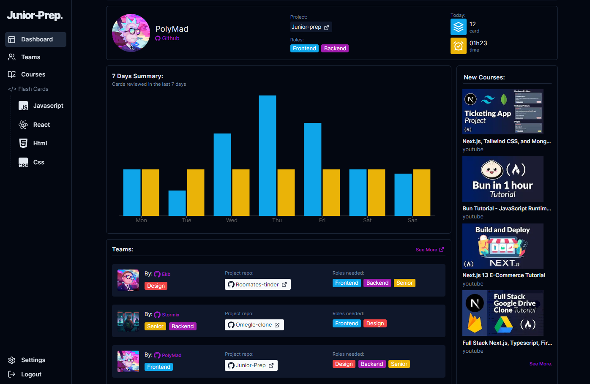

    
    <h1>Ace Your Interviews with Junior-Prep.</h1>
    
    
  **Live App ** : [https://junior-prep.vercel.app/](https://junior-prep.com)
    

# about

junior-prep is a website for junior web developers to practice interview questions, record your progress and find teams to collaborate with.

## Features

-   practice interview questions
    (The aim of these questions / answers is not to be perfectly accurate word for word.) - anki like system to study - relevant and updated questions (please contribute if you can) - track your daily progress

-   Find Teams collaborating on portfolio worthy projects
    -   learn how to collaborate with a team
    -   find the role that suits you best:
        -   designer (not only design but also track the project's progress and ensure the best user experience)
        -   frontend
        -   backend
        -   fullsatck

## How can I contribute?

-   you can report issues in our website here [issues](https://github.com/polymahh/junior-prep/issues)
-   you can suggest new questions/answers in our [discord](https://discord.gg/uYHYYMvrAd)
    or as an [issue](https://github.com/polymahh/junior-prep/issues/new)
    start your issue's title with (card suggestion)

## License

Licensed under the [MIT license](https://github.com/shadcn/ui/blob/main/LICENSE.md).
